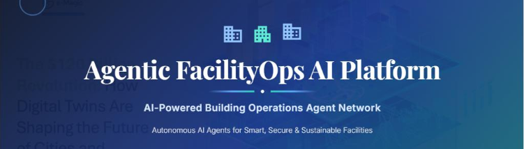

<div align="center">



# Agentic FacilityOps AI Platform

**AI-Powered Building Operations Agent Network**

[](https://www.python.org/)
[](https://flask.palletsprojects.com/)
[](https://www.sqlite.org/)
[](https://www.chartjs.org/)

</div>

---

### Energy Agent + Maintenance Agent + Occupancy Agent + Security Agent

A working reference implementation of the Agentic FacilityOps AI Platform's
**Energy Agent**, **Maintenance Agent**, **Occupancy Agent**, and **Security
Agent** — each with live dashboards, a REST API, and a realistic seeded
dataset (4 facilities, 23 assets, 8 weeks of hourly energy readings, daily
equipment sensor readings, 6-hourly occupancy readings across 6 zones per
facility, and 35–60 security events per facility).

This covers **Milestones 1–3** of the project spec (Energy Intelligence,
Predictive Maintenance, and Occupancy & Security Intelligence). Milestone 4
(Cost Optimization Agent + executive dashboards + cross-agent orchestration)
remains a "Coming Soon" card on the overview page.

---

## What's implemented

### ⚡ Energy Agent

* Integrates simulated utility/IoT electricity & water usage data
* Consumption analytics (totals, cost estimate, carbon estimate)
* **Anomaly detection** using z-score statistics over electricity usage
* **HVAC efficiency analysis** vs. lighting/equipment/other load
* **Lighting schedule optimization** — flags overnight (22:00–06:00) waste
* **Energy-saving recommendations** generated from the above analytics
* **7-day demand forecast** (weighted moving average + trend)
* Live dashboard with KPIs, a consumption chart, a load-distribution donut
  chart, a consumption-vs-anomalies chart, a forecast chart, and
  recommendation cards

### 🔧 Maintenance Agent

* Ingests simulated asset sensor data (vibration, temperature, runtime hours)
* **Equipment health scoring** (0–100) from vibration/temperature penalties
* **Failure-risk prediction** — linear trend extrapolation to estimate days
  until an asset crosses a critical vibration threshold
* **Asset lifecycle tracking** (age vs. expected life, % lifecycle used)
* **Auto-generated work orders** for Warning/Critical assets, prioritized
  and due-dated
* Live dashboard with KPIs, a per-asset health bar chart, a health
  distribution donut chart, and a work-order queue

### 👥 Occupancy Agent *(Milestone 3)*

* Monitors per-zone occupancy counts against capacity (Office Floors,
  Meeting Rooms, Common Areas, Parking Areas, Cafeteria, Lobby)
* **Zone utilization analytics** — average & peak utilization per zone,
  classified Balanced / Overcrowded / Underused
* **Overcrowding detection** — flags any reading at ≥90% of zone capacity
* **Occupancy heatmap** — average utilization by weekday × time-of-day
* **Workspace allocation recommendations** — pairs overcrowded zones with
  underused ones and suggests reallocation
* **7-day usage forecast** (weighted moving average + trend, same method
  as the Energy Agent's demand forecast)
* Live dashboard with KPIs, a zone-utilization bar chart, a forecast chart,
  a color-coded heatmap grid, zone/overcrowding detail tables, and
  recommendation cards

### 🛡️ Security Agent *(Milestone 3)*

* Ingests simulated access-control / CCTV event data (Unauthorized Access
  Attempt, Tailgating, After-Hours Access, Forced Door Alarm, Badge
  Mismatch, CCTV Motion) with Low/Medium/High/Critical severity
* **Severity distribution** analytics across all monitored events
* **Zone risk ranking** — ranks zones by critical/high event counts to
  surface hotspots
* **Unauthorized-access trend** — daily count of unauthorized-access-type
  events, for spotting spikes
* **Auto-generated security alerts** — escalates zones with critical events
  or elevated event volume, and flags unauthorized-access spikes, to
  support incident investigation
* Live dashboard with KPIs, a severity donut chart, a stacked zone-risk bar
  chart, an unauthorized-access trend line, a recent-events table, and
  alert cards

All four agents share a common SQLite database whose schema matches the ER
diagram in the project spec (`facilities`, `assets`, `energy_usage`,
`maintenance_records`, `occupancy_records`, `security_events`, plus
`cost_reports` and `alerts` tables reserved for the Cost Optimization Agent).

---

## Project structure

```text
Agentic-FacilityOps-Platform/
├── agents
│   ├── __init__.py
│   ├── cost_agent.py
│   ├── energy_agent.py
│   ├── intelligence_engine.py
│   ├── maintenance_agent.py
│   ├── occupancy_agent.py
│   └── security_agent.py
├── database
│   ├── __init__.py
│   ├── cost_optimization_dataset.csv
│   ├── load_cost_dataset.py
│   ├── schema.sql
│   └── seed_data.py
├── static
│   ├── css
│   │   └── style.css
│   └── js
│       ├── vendor
│       │   └── chart.umd.min.js
│       ├── chart-loader.js
│       ├── cost_dashboard.js
│       ├── energy_dashboard.js
│       ├── executive_dashboard.js
│       ├── maintenance_dashboard.js
│       ├── occupancy_dashboard.js
│       └── security_dashboard.js
├── templates
│   ├── cost_dashboard.html
│   ├── energy_dashboard.html
│   ├── executive_dashboard.html
│   ├── index.html
│   ├── login.html
│   ├── maintenance_dashboard.html
│   ├── occupancy_dashboard.html
│   └── security_dashboard.html
├── .gitignore
├── app.py
├── canvas.png
├── LICENSE
├── README.md
└── requirements.txt
```

---

## Setup & run

Requires Python 3.9+.

### Recommended: Virtual Environment

Create and activate a virtual environment before installing dependencies:

```bash
python -m venv venv
```

**Windows:**

```bash
venv\Scripts\activate
```

**macOS / Linux:**

```bash
source venv/bin/activate
```

Then install the project dependencies:

```bash
cd agentic-facilityops
pip install -r requirements.txt

# Seed the demo database (4 facilities, 23 assets, ~8 weeks of data)
python database/seed_data.py

# Start the app
python app.py
```

Then open **http://localhost:5000** in your browser.

* `/` — overview and module launcher
* `/energy` — Energy Agent dashboard
* `/maintenance` — Maintenance Agent dashboard
* `/occupancy` — Occupancy Agent dashboard
* `/security` — Security Agent dashboard

The database is also auto-seeded on first run if `facilityops.db` doesn't
exist yet, so `python app.py` alone works too.

---

## REST API reference

### Energy Agent

| Endpoint                                               | Description                                              |
| ------------------------------------------------------ | -------------------------------------------------------- |
| `GET /api/energy/summary?facility_id=&days=`           | Total kWh/water, cost, efficiency score, carbon estimate |
| `GET /api/energy/timeseries?facility_id=&days=`        | Daily electricity/water series for charting              |
| `GET /api/energy/load-distribution?facility_id=&days=` | HVAC/lighting/equipment/other load split                 |
| `GET /api/energy/anomalies?facility_id=&days=`         | Z-score anomaly list + detection accuracy                |
| `GET /api/energy/forecast?facility_id=`                | 7-day demand forecast                                    |
| `GET /api/energy/recommendations?facility_id=&days=`   | AI-generated efficiency recommendations                  |

### Maintenance Agent

| Endpoint                                        | Description                                                           |
| ----------------------------------------------- | --------------------------------------------------------------------- |
| `GET /api/maintenance/summary?facility_id=`     | Assets monitored, avg health, predicted failures, health distribution |
| `GET /api/maintenance/assets?facility_id=`      | Per-asset health score, trend, risk band, days-to-critical            |
| `GET /api/maintenance/work-orders?facility_id=` | Auto-generated, prioritized work orders                               |
| `GET /api/maintenance/asset/<asset_id>`         | Full detail + sensor history for one asset                            |

### Occupancy Agent

| Endpoint                                                | Description                                                        |
| ------------------------------------------------------- | ------------------------------------------------------------------ |
| `GET /api/occupancy/summary?facility_id=&days=`         | Occupancy rate, active occupants, overcrowding count, busiest zone |
| `GET /api/occupancy/zones?facility_id=&days=`           | Per-zone avg/peak utilization, capacity, status                    |
| `GET /api/occupancy/heatmap?facility_id=&days=`         | Weekday × time-of-day average utilization matrix                   |
| `GET /api/occupancy/overcrowding?facility_id=&days=`    | Readings at/above 90% zone capacity                                |
| `GET /api/occupancy/forecast?facility_id=`              | 7-day occupancy forecast                                           |
| `GET /api/occupancy/recommendations?facility_id=&days=` | AI-generated workspace allocation recommendations                  |

### Security Agent

| Endpoint                                                     | Description                                                             |
| ------------------------------------------------------------ | ----------------------------------------------------------------------- |
| `GET /api/security/summary?facility_id=&days=`               | Total events, unauthorized-access count, critical events, zones flagged |
| `GET /api/security/events?facility_id=&days=`                | Recent raw event list                                                   |
| `GET /api/security/severity-distribution?facility_id=&days=` | % of events by severity                                                 |
| `GET /api/security/zone-risk?facility_id=&days=`             | Zones ranked by critical/high event counts                              |
| `GET /api/security/unauthorized-trend?facility_id=&days=`    | Daily unauthorized-access-type event counts                             |
| `GET /api/security/alerts?facility_id=&days=`                | Auto-generated, prioritized security alerts                             |

`facility_id` is optional on every endpoint — omit it to aggregate across
all facilities.

---

## Notes on the demo data

`database/seed_data.py` generates 8 weeks of synthetic-but-realistic data:
daily/weekly load curves for energy (~2% injected consumption spikes for
anomaly testing), a subset of assets deliberately trending toward failure,
6-hourly occupancy readings per zone with realistic weekday/weekend and
peak-hour curves, and 35–60 randomly-severity-weighted security events per
facility. Re-run it any time to reset the dataset (uses a fixed random seed
for reproducibility).

## Extending the platform

The schema already includes `cost_reports` and `alerts` tables, and the
front-end nav has a placeholder card for the Cost Optimization Agent
(Milestone 4) — follow the same `agents/<name>_agent.py` +
`/api/<name>/...` + dashboard template pattern used here to build it out,
along with cross-agent orchestration and executive dashboards.
